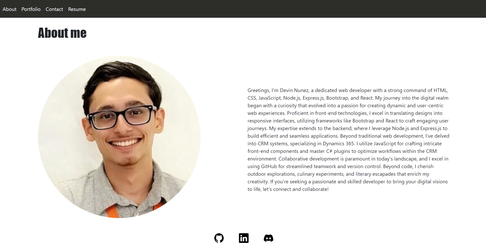
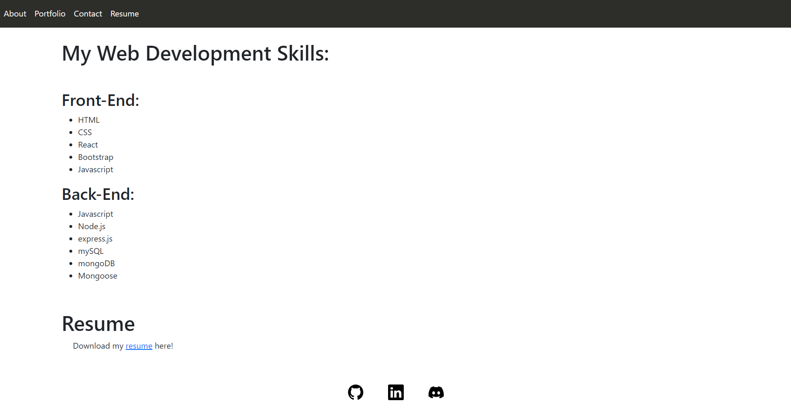

# README.MD React Portfolio

## Author

Devin Nunez

Email: devv-nunn@gmail.com
git: https://github.com/devv-nunn

## Description

In this project we will be creating a react application that displays some of our react skills and past projects.

This project took use of react routers, forms, and useState(). 

## Table of Contents (Optional)

N/a

## Installation

- vs.code installed to use this applicationn

- Clone the following repository after installing vs.code 

- in terminal run npm i as it will download necessary dependencies then run npm run start to start your react application.

## Usage

- To use this application go to terminal and run "npm i" as it will download necessary dependencies then run "npm run start" to start your react application.

## Application screenshots

## Videos Demonstrating application:

application functionality showcase:
https://drive.google.com/file/d/1Jf76aNdXSAlJR0ENvv40R2dS7FPKQBXe/view

## Deployment

Repo: https://github.com/DevinDevelopment/ReactPortfolio

# Tech Stack

Html
CSS
React
Bootstrap

## Credits

N/a

## License

MIT License.